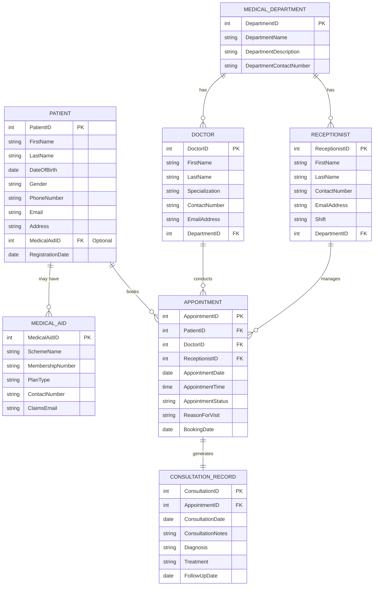

# Entity-Relationship Diagram (ERD)
## Healthcare Appointment Management System

## ERD Description

### Entities Overview

| Entity | Primary Key | Purpose |
|--------|------------|---------|
| **Patient** | PatientID | Stores patient personal information and medical aid references |
| **Doctor** | DoctorID | Stores doctor details and department affiliation |
| **Medical Department** | DepartmentID | Organizes doctors and receptionists by department |
| **Appointment** | AppointmentID | Manages appointment scheduling and tracking |
| **Consultation Record** | ConsultationID | Records medical consultation details post-appointment |
| **Receptionist** | ReceptionistID | Manages appointments and patient interactions |
| **Medical Aid** | MedicalAidID | Stores medical scheme membership information |

### Relationships Summary

| From | To | Type | Cardinality | Explanation |
|------|----|----|---|---|
| Patient | Medical Aid | May have | 1:0..1 | Optional relationship for insured/self-paying patients |
| Patient | Appointment | Books | 1:M | One patient can have multiple appointments |
| Doctor | Appointment | Conducts | 1:M | One doctor can attend multiple appointments |
| Medical Department | Doctor | Has | 1:M | One department has multiple doctors |
| Medical Department | Receptionist | Has | 1:M | One department has multiple receptionists |
| Receptionist | Appointment | Manages | 1:M | One receptionist manages multiple appointments |
| Appointment | Consultation Record | Generates | 1:1 | Each appointment generates exactly one consultation record |

### Key Design Decisions

1. **System-Generated IDs**: All primary keys use system-generated identifiers for stability and uniqueness
2. **Optional Medical Aid**: MedicalAidID is optional to accommodate self-paying and uninsured patients
3. **Separate Medical Aid Entity**: Normalizes medical scheme information separately from patient data
4. **Appointment as Central Entity**: Links patients, doctors, and receptionists
5. **Consultation Record Separation**: Maintains medical records separately from appointment bookings
6. **Department Organization**: Groups doctors and receptionists for organizational structure and reporting
